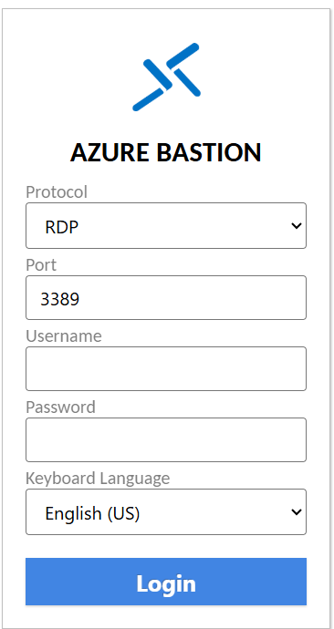
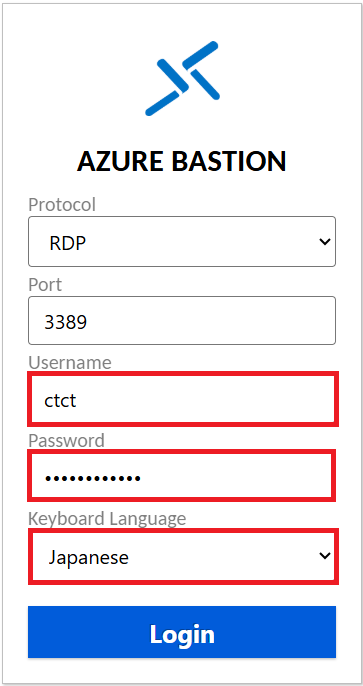
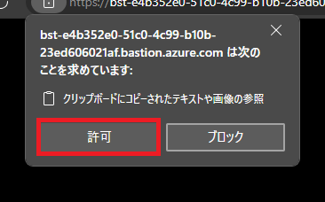
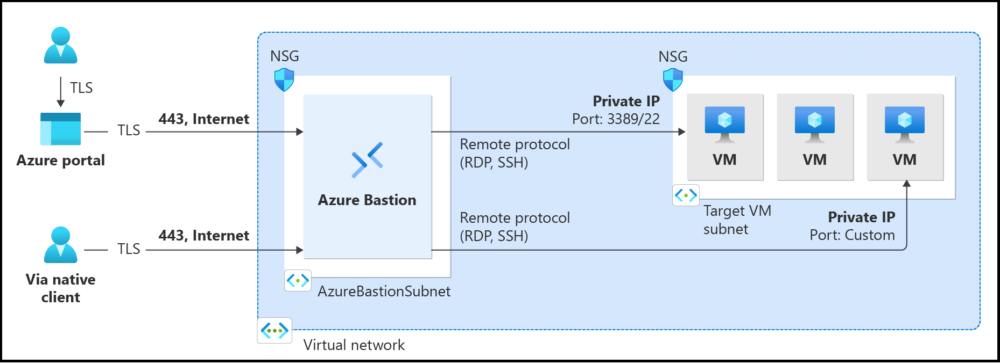

# 演習環境アクセス手順

## ラボ シナリオ

この手順では演習環境へWebブラウザを使用してアクセスする方法について説明します。

講師より入手したURLとアカウント情報を使用して、演習環境へアクセスしてください。

※演習環境はMicrosoft Azureの「Virtual Machines」サービスを使用しています。

予想時間: 5分

### Azure Bastionを使用したアクセス手順

1.講師から送付された接続先URLにアクセスしてください。ログイン画面が表示されます。

2.以下の内容を入力し「Login」をクリックします。

| 項目              | 値               |
| ----------------- | ---------------- |
| Protocol          | `RDP` （既定値） |
| Port              | `3389`（既定値） |
| Username          | `ctct`           |
| Password          | `Pa55w.rd1234`   |
| Keyboard Language | `Japanese`       |

※注意点※
 パスワードが違うと「Connection Error」になります。
 演習環境のアクセスするパスワードは[Pa55w.rd1234]です。

3.演習環境（Windows Server）の画面が表示されます。

4.ブラウザのURL欄に警告される場合があります。「許可」をクリックします。

>この警告は、クリップボードへのアクセス許可を求めるものになります。
>
>許可しない（ブロック）場合は、ローカルの環境から演習環境へのコピー＆ペーストができなくなります。

これで演習環境へのアクセスが完了しました。

以降は講師の指示に従い、テキストの演習手順を実施してください。

------

**【参考】Microsoft Azureにご興味のある方向け**

本研修で使用する演習環境はMicrosoftのクラウドプラットフォーム「Microsoft Azure」を使用しています。

Azureサービスの「Virtual Machine (仮想マシン)」を使用してクラウド上 (Microsoftのデータセンター)にWindows Serverを構築しています。

> Azure での仮想マシン： https://learn.microsoft.com/ja-jp/azure/virtual-machines/overview

この仮想マシンへアクセスする場合、Windowsではリモートデスクトップ接続を行います。

ネットワークはパブリックインターネット経由、VPN経由、専用線接続(閉域網)でアクセスを行います。

パブリックインターネットで接続する場合、リモートデスクトップ接続(RDP：3389ポート)を解放する必要があります。

ですが、第三者からの攻撃によりRDPポートを攻撃され仮想マシンが乗っ取られる可能性もあります。

> リモート管理の脅威：https://learn.microsoft.com/ja-jp/azure/security/fundamentals/management#remote-management-threats

そのため、RDPポートはファイヤーウォールなどによりブロックすることが一般的です。

> この演習環境においてはRDPポートは解放しています。

あるいは、社内ネットワークからデータの不正流出を防ぐために、ネットワーク自体でRDPポートを遮断(ファイヤーウォールなど)することがあります。

その場合、メンテナンスや操作などにおいて、RDP接続が出来ない状態になります。

そこで使用するのが、RDP(3359)の接続ではなく、Webブラウザ経由のTLS(443)を使用したアクセス方法があります。

それが、今回操作して頂いた「Azure Bastion」というサービスになります。

> Azure Bastion とは：https://learn.microsoft.com/ja-jp/azure/bastion/bastion-overview

このサービスは、Bastionが踏み台コンピュータとなります。

インターネット上に仮想マシンのグローバルIPアドレスを公開することなく且つ、Webブラウザ経由でセキュアに通信を行うことが可能です。

